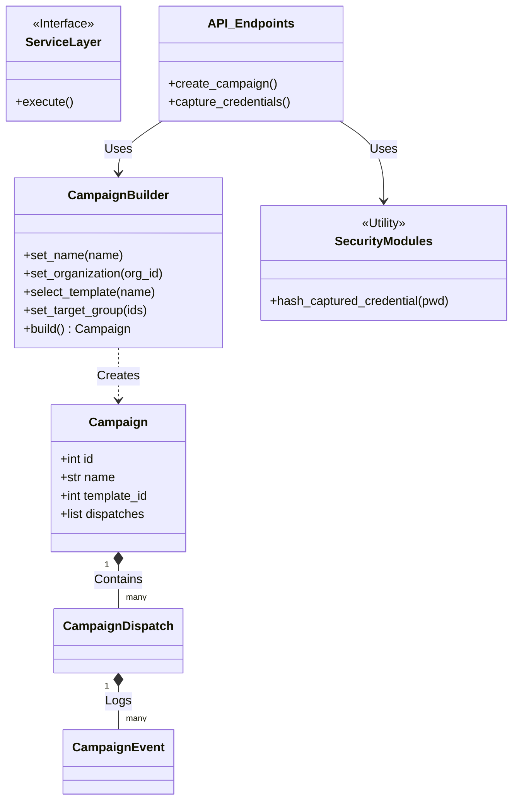

# Security Awareness Platform (Phishing Simulator)

Este proyecto es una plataforma integral de simulación de phishing diseñada para evaluar y mejorar la conciencia de seguridad dentro de una organización. Permite a los administradores crear, gestionar y rastrear campañas de phishing simuladas, proporcionando métricas detalladas y educación inmediata a los usuarios que caen en la simulación.

## 🚀 Propósito

El objetivo principal es educativo y preventivo. La herramienta ayuda a:

- Identificar vulnerabilidades en el comportamiento de los empleados frente a correos de phishing.
- Entrenar a los usuarios mediante la exposición práctica a ataques simulados.
- Medir la efectividad de los programas de concientización de seguridad a lo largo del tiempo.

## ✨ Características Principales

- **Gestión de Campañas**: Creación y orquestación de campañas de phishing enviadas por correo electrónico.
- **Seguimiento Detallado**: Monitorización de eventos clave:
  - Apertura de correo (Tracking Pixel).
  - Clic en enlaces (Landing Page).
  - Envío de credenciales (Captura de datos).
- **Captura Segura**: Las credenciales capturadas se **hashean inmediatamente** (usando bcrypt/Argon2 via Passlib) y nunca se almacenan en texto plano, garantizando la privacidad y seguridad, incluso en simulaciones.
- **Educación "Just-in-Time"**: Redirección automática a una página educativa cuando un usuario compromete sus credenciales.
- **Infraestructura Robusta**: Uso de colas de tareas asíncronas para el envío masivo de correos y la rotación de IPs.

## 🛠️ Arquitectura

El proyecto utiliza una arquitectura moderna basada en microservicios y contenedores:

- **Backend**: Python con **FastAPI** para una API RESTful de alto rendimiento.
- **Base de Datos**: **PostgreSQL** (async) para el almacenamiento persistente de campañas y resultados.
- **Colas de Tareas**: **Celery** con **Redis** para el manejo de tareas en segundo plano (envío de emails, procesamiento de eventos).
- **Proxy Inverso**: **Traefik** para el enrutamiento de tráfico y gestión automática de certificados SSL (configurado para Let's Encrypt).
- **Contenedores**: Todo el sistema está orquestado con **Docker Compose**.

## 📋 Requisitos Previos

Antes de comenzar, asegúrate de tener instalado:

- [Docker](https://www.docker.com/get-started)
- [Docker Compose](https://docs.docker.com/compose/install/)

## 🚀 Instalación y Uso (Docker)

La forma recomendada de desplegar la aplicación es utilizando Docker Compose.

1.  **Clonar el repositorio**:

    ```bash
    git clone https://github.com/George230297/phishing-orchestrator-platform.git
    cd phishing-orchestrator-platform
    ```

2.  **Configuración de Entorno**:
    Es **CRÍTICO** configurar las variables de entorno antes de iniciar.

    ```bash
    cp .env.example .env
    ```

    Edita el archivo `.env` y define contraseñas seguras para:
    - `POSTGRES_PASSWORD`
    - `SECRET_KEY` (si aplica en el futuro)

3.  **Iniciar Servicios**:
    ```bash
    docker-compose up --build -d
    ```

## 💻 Desarrollo Local

Si deseas ejecutar la aplicación localmente para desarrollo:

1.  **Preparar Entorno Virtual**:

    ```bash
    python -m venv venv
    # Windows
    .\venv\Scripts\activate
    # Linux/Mac
    source venv/bin/activate
    ```

2.  **Instalar Dependencias**:

    ```bash
    pip install -r requirements.txt
    ```

3.  **Iniciar Dependencias (DB & Redis)**:
    Puedes usar Docker solo para la infraestructura:

    ```bash
    docker-compose up -d db redis
    ```

4.  **Ejecutar Aplicación**:
    ```bash
    uvicorn app.main:app --reload
    ```

## 🧪 Pruebas

Para verificar que todo funciona correctamente, ejecuta la suite de pruebas:

1.  Asegúrate de tener las dependencias instaladas y el archivo `.env` configurado.
2.  Ejecuta `pytest`:

    ```bash
    pytest
    ```

3.  **Verificar Estado**:
    Los servicios principales estarán disponibles en:
    - **API Backend**: `http://localhost:8000` (o a través de Traefik en `http://localhost` / `https://localhost`)
    - **Traefik Dashboard**: `http://localhost:8080` (si está habilitado insecure mode)

4.  **Documentación de la API**:
    Para ver y probar los endpoints disponibles, visita la documentación interactiva generada automáticamente por Swagger UI:
    - URL: `http://localhost:8000/docs`

## 🛡️ Notas de Seguridad

- Esta herramienta debe ser utilizada **UNICAMENTE** con autorización explícita y propósitos educativos.
- El almacenamiento de credenciales, aunque sea en forma de hash, debe tratarse con la máxima sensibilidad y cumplir con las regulaciones de protección de datos aplicables.

## 🤝 Contribuir

Las contribuciones son bienvenidas. Por favor, abre un issue o envía un pull request para mejoras o correcciones.

## ✨ Mejoras Recientes

### Privacidad y Métricas (Anonymizer)

Las campañas administradas con el flag `is_anonymous_reporting = True` ahora implementan un proceso de anonimización criptográficamente seguro:

- **Hashes SHA-256 Salteados**: Las identidades de los objetivos (ID y Email) ya no se marcan ciegamente como "REDACTED". En su lugar, se transforman en hashes SHA-256 usando un _salt_ del sistema. Esto permite correlacionar métricas (ej. "el mismo usuario hizo clic 3 veces") sin revelar su PII (Información Personal Identificable).
- **Minimización de Huella**: Eliminación preventiva de las cadenas de _User-Agent_ en reportes anónimos.

### Implementación del Patrón Builder para Campañas

Se ha introducido la clase `CampaignBuilder` (`app/services/campaign_builder.py`) para facilitar la creación de campañas de phishing complejas de manera programática y segura.

**Características:**

- **Interfaz Fluida**: Configuración encadenable (`.set_name()`, `.select_template()`, etc.).
- **Validación de Integridad**: Garantiza que no se creen campañas incompletas o inválidas antes de persistir en la base de datos.
- **Gestión Automatizada**: Maneja la creación de la campaña y la asignación inicial de objetivos (dispatches) en una sola transacción.

### Robustez en Pruebas Automatizadas

Se ha mejorado la suite de pruebas unitarias (`tests/`):

- **Independencia de Entorno**: Los tests ahora verifican dinámicamente la configuración del entorno, asegurando que pasen tanto en entornos de desarrollo local como en pipelines de CI/CD.
- **Mocking Preciso**: Corrección de advertencias y errores en pruebas asíncronas mediante el uso adecuado de mocks para operaciones de base de datos síncronas y asíncronas.

### Mejoras de Seguridad y Estabilidad (v1.1)

- **Configuración Validada**: Se ha reforzado la validación de variables de entorno con Pydantic, ignorando variables extrañas y asegurando la presencia de `SECRET_KEY`.
- **Hashing con Argon2**: Se ha migrado el algoritmo de hashing de contraseñas capturadas de `bcrypt` a `Argon2` (vía `passlib`), ofreciendo mayor resistencia a ataques de fuerza bruta modernos y mejor compatibilidad.
- **Registro Real de IPs**: El sistema ahora respeta los encabezados `X-Forwarded-For`, permitiendo registrar la dirección IP real de las víctimas incluso cuando la aplicación corre detrás de proxies o balanceadores de carga (como Traefik/Docker).
- **Tipado Fuerte en Modelos**: Uso de Enums (`SubscriptionPlanEnum`) en modelos de base de datos para garantizar la integridad de los datos.

## 🚀 Instalación y Ejecución Rápida

### Requisitos

- Python 3.10+
- Docker & Docker Compose (Opcional, para DB/Redis)

### Pasos

1.  **Clonar y configurar entorno**:

    ```bash
    git clone https://github.com/tu-usuario/phishing-orchestrator-platform.git
    cd phishing-orchestrator-platform
    python -m venv .venv
    # Windows
    .\.venv\Scripts\activate
    # Linux/Mac
    source .venv/bin/activate
    ```

2.  **Instalar dependencias**:

    ```bash
    pip install -r requirements.txt
    ```

3.  **Configurar variables de entorno**:

    ```bash
    cp .env.example .env
    # Editar .env y establecer SECRET_KEY, POSTGRES_USER, etc.
    ```

4.  **Iniciar servicios auxiliares (DB & Redis)**:

    ```bash
    docker-compose up -d db redis
    ```

5.  **Ejecutar la aplicación**:
    ```bash
    uvicorn app.main:app --reload
    ```
    La API estará disponible en `http://localhost:8000/docs`.

## 🧩 Arquitectura y Patrones de Diseño

El siguiente diagrama UML ilustra la estructura modular del proyecto y cómo se aplican los patrones de diseño clave, como el **Builder** para la construcción de campañas y la separación de capas (Modelos, Servicios, API).



Este diseño asegura:

- **Alta Cohesión**: Cada módulo tiene una responsabilidad clara (Builder construye, Modelos almacenan, API expone).
- **Bajo Acoplamiento**: La lógica de negocio (Servicios) está separada de la capa de presentación (API).
- **Extensibilidad**: Nuevos tipos de campañas o vectores de ataque pueden añadirse extendiendo los Enums y Servicios sin romper el código existente.
